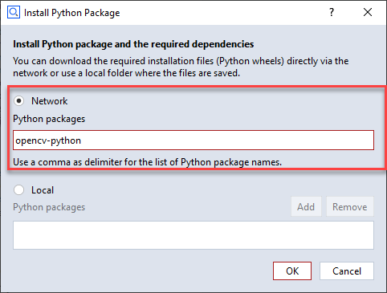

# Display measurement image from project 

This example demonstrates how to read a measurement image from a project and display it in PNG format in a user defined script dialog.

## Example

## Preliminaries

* For the sake of simplicity it is assumed that the measurement list from which the image is read has a fixed name ('Scan 1').
* You have to install [OpenCV python](https://pypi.org/project/opencv-python/) for the example to run.
* The example code must be part of an add-on, so that this python wheel can be added to that add-on's environment.

